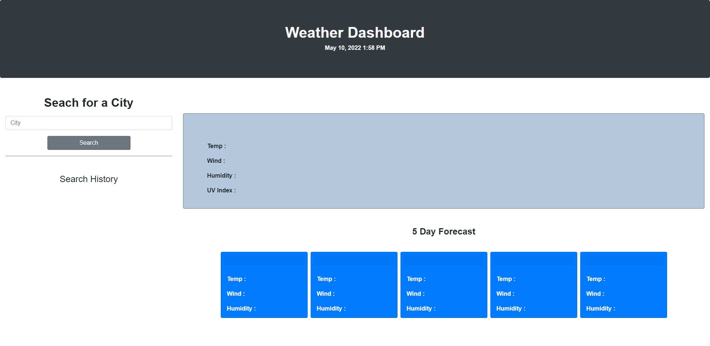
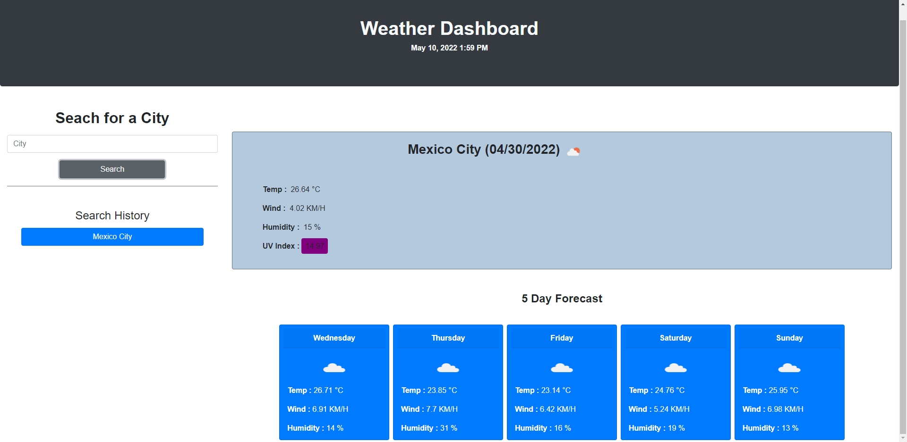
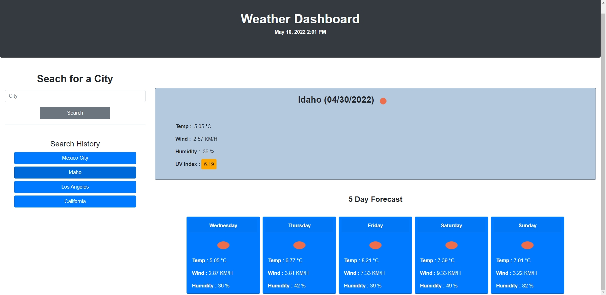
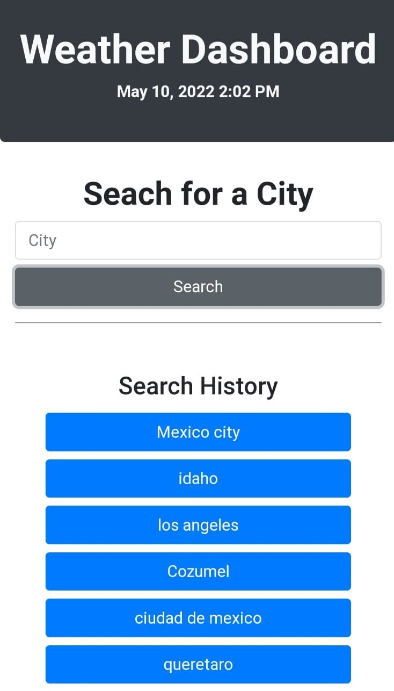
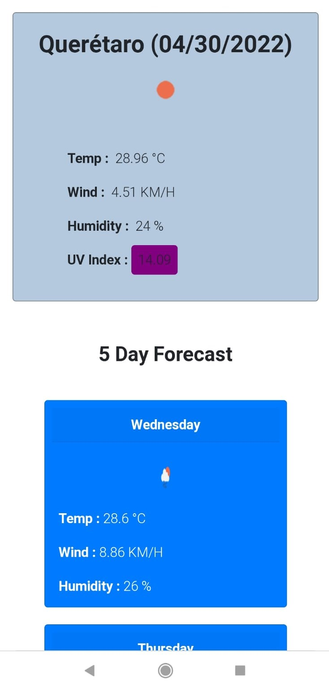

# Weather-Dashboard

# This proyect is about givin a user the current weather for a specific city along the globbe and 5 day forecast weather for that city

# About the web

* For this proyect I used the open weather API in order to request the weather information this web display for each searched city.
* Link for the API here: https://openweathermap.org/api

* Well, once the user enter the name of the city through the input and click on search, the current weather information will be display as well the 5 day forecaste for the same city. 

* The current weather information gives the user information like the name of the city serached, the actual date, temperature, wind speed, humidity, and only for the current weather information, the user will see the UV Index too.

* When the user watch the UV index, this will have a different backgroung color that indicates whether the conditions are favorable, moderate, or severe.

* Every city the user search, this city will be storage in the search history, if the user click any of those search history buttons the user will be given the weather for that specific city again.

* Every card will diplay an icon according the weather conditions.

# TECHNOLOGIES 

* I used JavaScript, HTML, Bootstrap 5 and CSS.

* I used CSS only to create a break point for mobile devices but in general, everything was done with bootstrap.

# Challenges
* I learned a lot how to do API requests, it was a little challenging cuz the firt call didn't gave me all the information I needed it, so I needed to do a second request to have  all the information. It was little tricky how to get the user input and pass that string to the API call, so I decided to create a function that recives an argument an that argument will be the user's input.

* I think the tough part was creating the search history, cuz I needed to create the elements and make that elements persitant, so in case the user reload the page the search history will be there. I learned a lot how to handle the local storage, so every city enter for the user, this city will be storage inside an array, a later in the code I will be able to work with that array so I can create all the search history.

* Honestly I need to work in my loop skills because I think I re-wrote a lot of code.

* For the icons, I used the icons provided for the  API.

# SCREENSHOTS
* View of the first time web runs

* Searching for a city

* Click on the search history button

* View for mobile devices 

# Link to the deployed web
https://angelmond.github.io/Weather-Dashboard/

# Thanks for watching my proyect! 